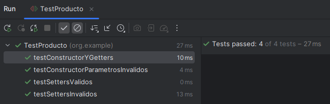
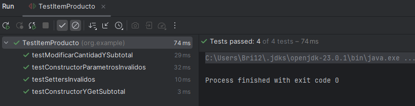
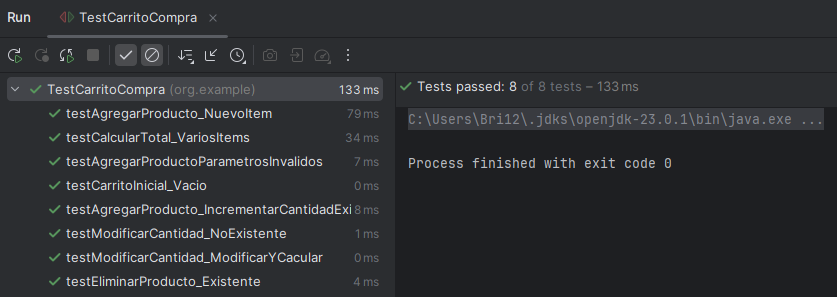

# Carrito de Compras con Pruebas Unitarias en JUnit

---

## 1. Descripción del proyecto  
Este proyecto es una implementación sencilla de un **Carrito de Compras** en Java, que incluye:  
- Las clases de dominio: `Producto`, `ItemCarrito` y `Carrito`.  
- Validaciones básicas en cada clase para garantizar integridad de datos.  
- Pruebas unitarias con **JUnit** para verificar el correcto funcionamiento de cada componente.  

El objetivo es demostrar buenas prácticas de programación orientada a objetos, uso de colecciones y prácticas de testing con JUnit.

---

## 2. Cómo compilar el proyecto  

1. Abre una terminal y navega hasta la carpeta raíz del proyecto (donde está el `pom.xml`).  
2. Ejecuta el comando de compilación.

- 
  ```bash
  mvn clean compile
  ```
---

## 3. Cómo ejecutar las pruebas unitarias  

- 
  ```bash
  mvn test
  ```
---
## 4. Capturas de pantalla de las pruebas exitosas 


